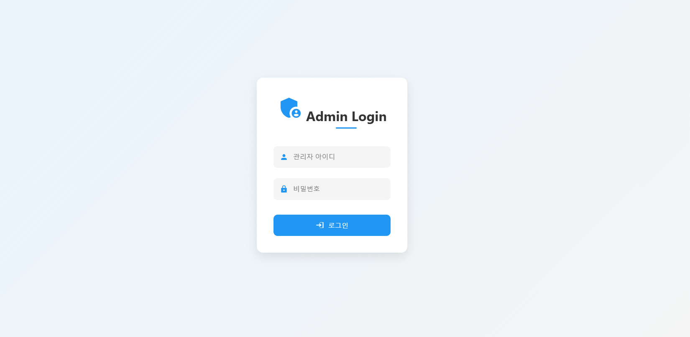
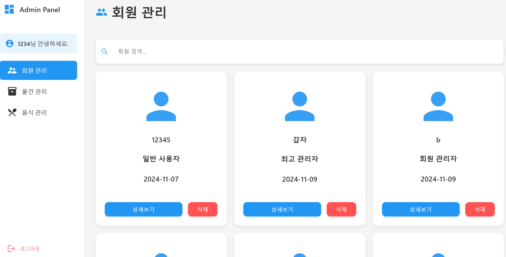
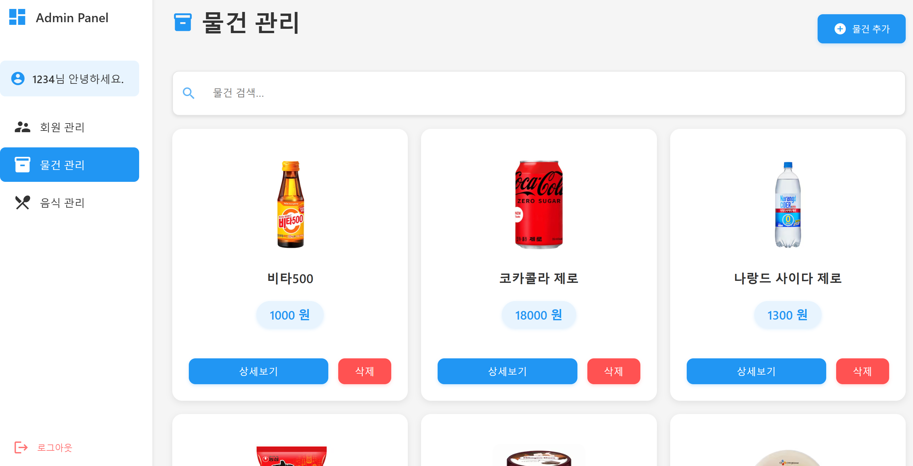
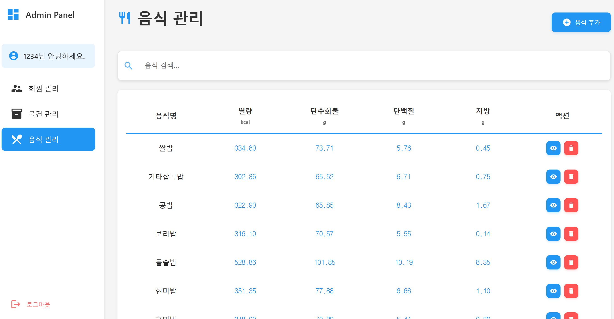

# N_M_Manager
- 식단 관리 애플리케이션의 운영 및 데이터 관리를 위한 통합 관리자 웹 페이지
- 사용자 관리, 음식 데이터 관리, 판매 물품 관리 기능 제공
## 프로젝트 구조
```
N_M_MANAGER
├── main
│   ├── java
│   │   ├── controller
│   │   ├── model
│   │   ├── repository
│   │   ├── service
│   │   ├── utils
│   │   └── ManageWebApplication.java
│   └── resources
│       ├── static
│       │   ├── css
│       │   └── js
│       ├── templates
│       └── application.properties
```
## 기술 스택
### 프론트엔드
<p>
  
  
  
  
</p>

### 백엔드
<p>
  
  
  
</p>


### 기타
<p>
  
  
  
</p>

## 스크린샷

### 로그인 페이지
<p align="center">
  
</p>

### 회원 관리 페이지
<p align="center">
  
</p>

### 물건 관리 페이지
<p align="center">
  
</p>

### 음식 관리 페이지
<p align="center">
  
</p>

## 문서
- [관리자 웹 페이지 화면 정의서](./assets/docs/관리자_웹_페이지_화면_정의서.pdf)
